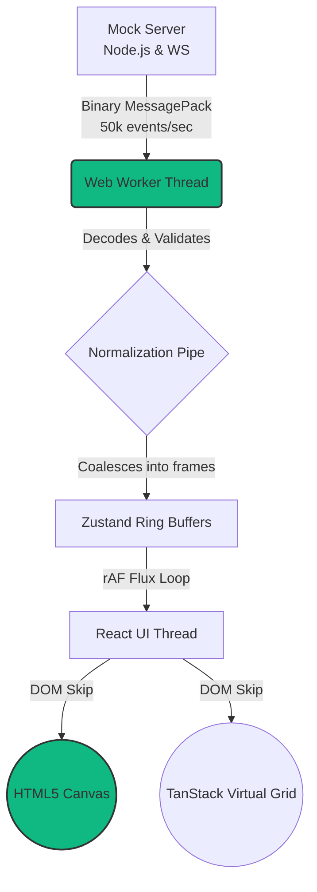

# TradeGrid ⚡ 

An institutional-grade, high-frequency cryptocurrency trading dashboard architected for extreme scale. By circumventing typical Web Framework bottlenecks using direct HTML5 Canvas API draw commands and Web Worker multi-threading, TradeGrid is capable of streaming **over 50,000 market events per second** at a nominal `60 FPS` frame budget.


> Note: Add a real preview screenshot corresponding to the layout here locally over the placeholder.

## 🏗️ Core Architecture



Our architecture relies on three primary acceleration vectors:
1. **MessagePack via WebSockets**: Streaming normalized binary reduces JSON stringification overhead over the wire by ~40%.
2. **Coalesced Ingestion**: The Web Worker intercepts the extreme 50k events/sec firehose, squashes overlapping records, and pushes ~60 `rAF` (requestAnimationFrame) consolidated arrays to the Main Thread, preventing React re-render starvation.
3. **Canvas Engine / CSS Skips**: DOM manipulation is entirely bypassed where it counts. The heavily updated Orderbook Depth and Heatmap use immediate-mode HTML Canvas directives, and the Trade Tape utilizes TanStack virtualization.

## 🚀 Setup & Launch

The project is structured into a Front-End dashboard and an isolated Node.js Mock Backend engine serving the data.

### 1. Prerequisites
- Node `v20+`
- `npm`

### 2. Startup (Concurrent)
Ensure dependencies are locked and launch both services locally via concurrently:

```bash
npm install
npm install --prefix server
npm run dev:all
```
This script simultaneously boots:
- `http://localhost:5173` (Vite + React)
- `ws://localhost:4000` (Node Backend)

### 3. Production Backend Testing
To hook into an external production backend (e.g. Render/Railway/Fly), modify your env file:
```bash
# Create .env
VITE_WS_URL=wss://your-tradegrid-backend.onrender.com
```

## 🧪 Testing Suite

TradeGrid is hardened by comprehensive testing methodologies managed through `Vitest` and `Playwright`.

### CI Procedures
- **Unit & Integration:** Run core memory buffering logic validation.
  `npm run test`
- **End-To-End Simulation:** Playwright invokes virtual headless browsers testing component hydration and real websocket data streaming logic.
  `npx playwright test`
- **Performance Profiling:** Memory-leak captures and deterministic replay benchmarks.

## 🌐 Deploying to Render
1. Create a Web Service connected to your repository on [Render](https://render.com/).
2. Your repository is already pre-configured with a `render.yaml` specification!
3. Blueprint sync the YAML file inside the Render dashboard to auto-populate the build environments for the standalone `tradegrid-mock-server`.

## 📄 License
MIT License
